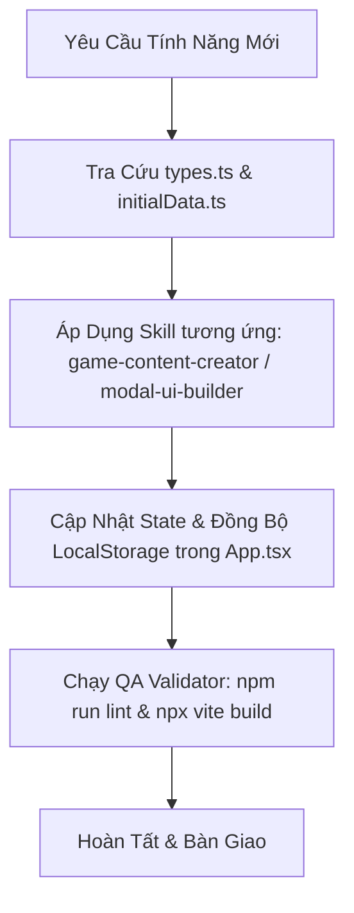

# Highway Survival RPG - Project Agent Guide & Rules

Chào mừng bạn đến với dự án Game **Highway Survival RPG** (Sinh Tồn Trên Cao Tốc). 
Tệp tài liệu này định hướng toàn bộ quy chuẩn phát triển, quy trình làm việc và hệ thống kỹ năng của dự án.

---

## 🛠️ Danh Sách Custom Skills Có Sẵn (.agents/skills/)

1. **[game-content-creator](file:///d:/Games/Game%20sinh%20t%E1%BB%93n/.agents/skills/game-content-creator/SKILL.md)**: Hướng dẫn tạo mới Kỹ Năng, Vật Phẩm, Boss, Bạn Cùng Phòng (Tenants), Quests.
2. **[combat-balancing](file:///d:/Games/Game%20sinh%20t%E1%BB%93n/.agents/skills/combat-balancing/SKILL.md)**: Công thức tính toán sát thương, bạo kích, phòng thủ, đồng đội trợ chiến và trích xuất chỉ số.
3. **[modal-ui-builder](file:///d:/Games/Game%20sinh%20t%E1%BB%93n/.agents/skills/modal-ui-builder/SKILL.md)**: Tiêu chuẩn thiết kế Modal, HUD, hiệu ứng âm thanh và theme màu Sci-Fi High-Density.
4. **[qa-validator](file:///d:/Games/Game%20sinh%20t%E1%BB%93n/.agents/skills/qa-validator/SKILL.md)**: Quy trình kiểm tra lỗi, TypeScript validation và checklist tính toàn vẹn dữ liệu.

---

## 📋 Các Quy Chuẩn Bắt Buộc (.agents/rules/)

- **[game-architecture.md](file:///d:/Games/Game%20sinh%20t%E1%BB%93n/.agents/rules/game-architecture.md)**: Kiến trúc hệ thống, phân chia components, quản lý state và âm thanh Web Audio API.
- **[data-consistency.md](file:///d:/Games/Game%20sinh%20t%E1%BB%93n/.agents/rules/data-consistency.md)**: Quy chuẩn đặt tên ID, tránh hardcode index mảng, đồng bộ sinh lực / năng lượng.

---

## 🚀 Quy Trình Phát Triển Chuẩn (Developer Workflow)

